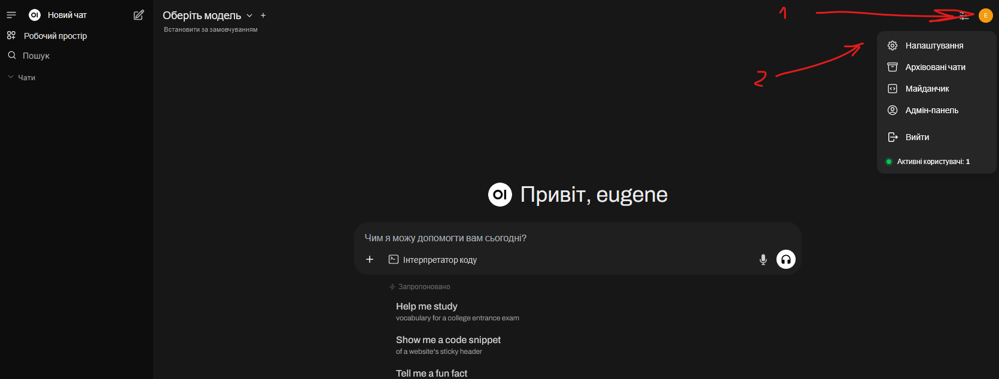
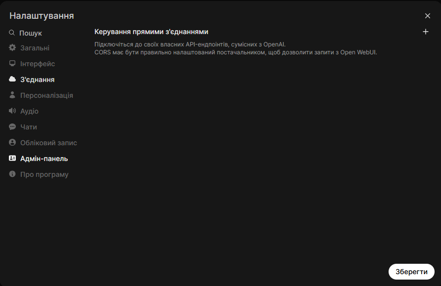
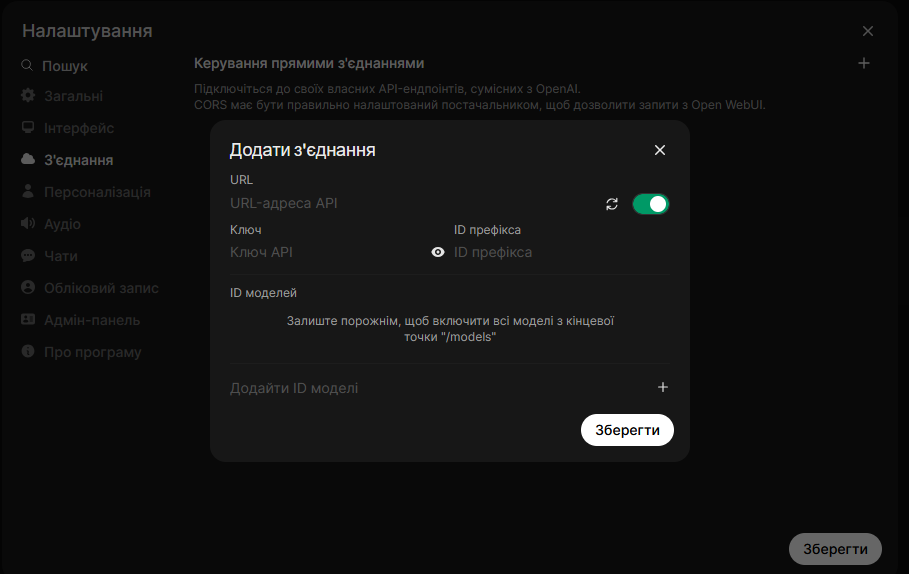
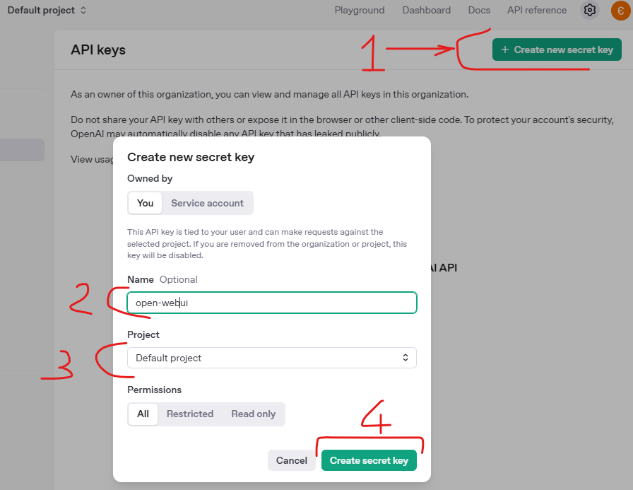
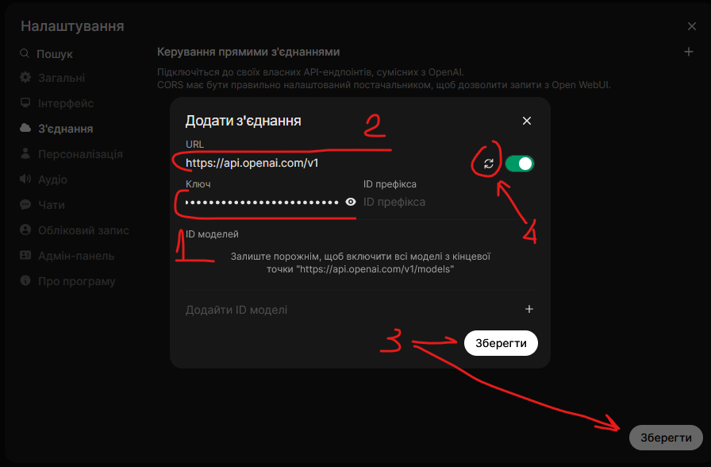
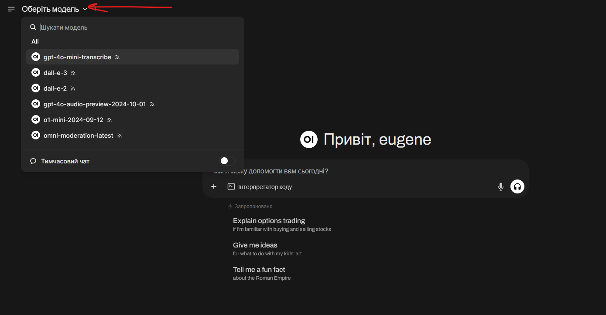
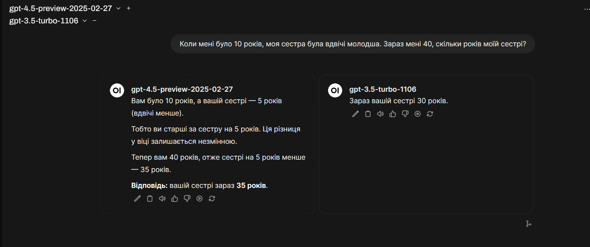
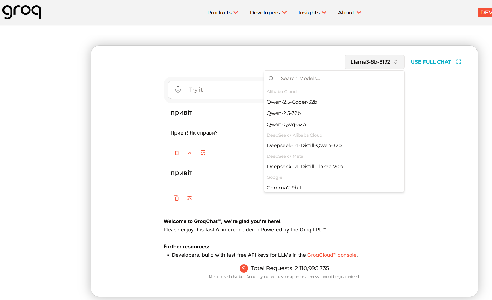

# OpenWEBUI+OpenAI

Created: March 24, 2025 7:52 PM
Tags: chatgpt, deepseek, docker, howto, litellm, ollama, openai, openwebui

Як не платити 20$ за платний план chatgpt? Я використовую chatgpt не сказати, що дуже часто, може 2-3 рази на тиждень, але майже завжди я натикаюсь на ліміт безкоштовного користування.


І двадцятка баксів, начебто і не так багато, але я точно розумію, що не використовую цей функціонал за який заплатив. От якби була б можливість платити не за місяць, а за день, а краще за годину, а ще краще за кожне повідомлення. 

І така можливість є. Потрібен тільки OpenWEBUI та обліковий запис для використання API OpenAI. 

```bash

https://openwebui.com/
```

**Open WebUI** 

Це інтерфейс для спілкування з різними мовними моделями. Сюди можна додавати як власні моделі, так і загальновідомі хмарні моделі, як chatgpt, deepseek та інші.


На сайті є інструкція, як запускати інтерфейс під різними системами, я обрав собі docker на linux

Для цього створюємо yaml файл

```yaml
services:
  ollama:
    image: ollama/ollama
    container_name: ollama
    restart: unless-stopped
    volumes:
      - ollama_data:/root/.ollama
    ports:
      - "11434:11434"
  openwebui:
    image: ghcr.io/open-webui/open-webui:0.5.20
    container_name: openwebui
    ports:
      - "8080:8080"
    environment:
      # Ollama Config
      - OLLAMA_BASE_URL=http://ollama:11434
    volumes:
      - data:/app/backend/data:rw
#    networks:
#      - frontend
    labels:
      - traefik.enable=true
      - traefik.http.routers.openwebui.rule=Host(`192.168.88.205`)
      - traefik.http.routers.openwebui.entrypoints=websecure
      - traefik.http.routers.openwebui.tls=true
      - traefik.http.routers.openwebui.tls.certresolver=cloudflare
      - traefik.http.routers.openwebui.service=openwebui
      - traefik.http.services.openwebui.loadBalancer.server.port=8080
    restart: unless-stopped

volumes:
  data:
    driver: local
  ollama_data:
networks:
  frontend:
    external: true
```

Після цього запускаємо наші контейнери 

```bash
docker compose up -d
```

Перший запуск буде довгим, там десь 1,5 гіга скачається

```bash
sudo docker ps
CONTAINER ID   IMAGE                                  COMMAND               CREATED         STATUS                             PORTS
   NAMES
60a78cbeca08   ghcr.io/open-webui/open-webui:0.5.20   "bash start.sh"       2 minutes ago   Up 13 seconds (health: starting)   0.0.0.0:8080->8080/tcp, [::]:8080->8080/tcp     openwebui
58d42a387fd7   ollama/ollama                          "/bin/ollama serve"   2 minutes ago   Up 13 seconds                      0.0.0.0:11434->11434/tcp, [::]:11434->11434/tcp  ollama
```

Треба ще трохи часу

Тепер відкриваємо наш інтерфейс

```bash
http://192.168.88.205:8080
```

Треба створити адміністратора


Після входу ми бачимо знайомий інтерфейс: зліва наші запити до моделей, праворуч активний діалог. В активному діалозі є можливість обрати модель, до якої ми робимо запит

І зараз нам треба додати сюди наші моделі



Відкриваємо профіль(1), заходимо в налаштування(2)

Переходимо в розділ “З’єднання”





Тепер розберемось з цінами та моделями, і зробимо наш APIключ, для цього заходимо на

```bash
[https://openai.com/api](https://openai.com/api)
```

Реєструємось, або заходимо з обліковим записом chatgpt і зліва відкриваємо розділ 
API Pricing. Тут вказано ціни за 4 моделей


отож, якщо приблизно, модель 4o по 10 баксів за один мільйон токенів. Токен, теж спрощенно, це як слово, там складна система підрахунку, але ми не про це. Головна засада тут для розробників, якщо ви просите написати код, то тут 1 токен = 1 символ коду.

Я закинув 5USD


Далі, в розділі API Keys створив перший ключ



1. Натискаємо створити
2. Обираємо назву цьому ключу
3. У мене один проект, тому тут просто дефолтне значення
4. І натискаємо Зберігання

Після чого копіюємо ключ.


 і повертаємось до OpenWEBUI. 



Тепер дивимось, які нам доступні моделі



Доречі, ми можемо обрати одразу декілька моделей і відправити один запит



Бачимо, як різні моделі відповідають на дитячу загадку.

Тепер додамо ще хмарних моделей від інших провайдерів.

```bash
https://console.groq.com
```

наприклад, тут ми можемо отримати моделі



і додамо справжнього грока

```bash
https://console.x.ai
```

А тепер те саме питання задамо на три моделі


Зліва так само є ваші чати з моделями, система самом додає до них якийсь емоджі. І є зручна штука, якої я не бачив в chatgpt: є можливість розкидати по папкам діалоги


